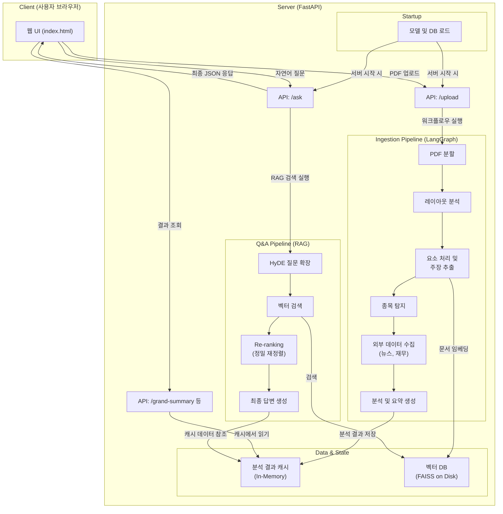

# README.md

# 1. 환경구성

1. uv 설치
2. python package 설치
    
    ```bash
    uv pip install langchain langchain-upstage langgraph faiss-cpu python-dotenv fastapi uvicorn
    uv pip install pymupdf pdfplumber
    uv pip install yfinance pykrx gnews
    ```
    - 실행 시 오류가 발생한다면 requirements.txt 또는 pyproject.toml 참고
   
3. 필요 API 발급 및 등록
    - .env
        
        ```bash
        UPSTAGE_API_KEY=up_***
        OPENAI_API_KEY=sk-*
        ```
        
    - upstage api는 콘솔 > 대시보드 - API keys 에서 확인
        - [Console - Upstage](https://console.upstage.ai/api-keys?api=chat)
        - 학생 크레딧 가입
            - https://velog.io/@link_dropper/upstage-free-soloar-pro
            - [Upstage-AWS AI Initiative](https://www.upstage.ai/events/ai-initiative-2025-ko)

## 2. 폴더 구조
```
├── static
│    └── index.html        # frontend
├── tmp                    # tmp 파일 저장(pdf 업로드/처리)
├── chains.py              # Langchain 처리 관련
├── dependencies.py        # LLM API, Embedding, ReRanker 모델 인스턴스
├── financial.py           # 재무지표 데이터 조회 관련 
├── graph_workflow.py      # LangGraph 노드,엣지 선언 및 실행
├── news_crawler.py        # 뉴스기사 크롤러, google news 사용
├── main.py                # 메인 앱 (실행)
├── rag.py                 # HyDE, Re-ranking
├── utils.py               # pdf 처리 등 유틸리티
└── vector_db.py           # embedding, vectorDB 관련

```

## 3. 실행방법

1. 폴더 이동
    
    ```python
    git clone https://github.com/ssum-2/2025_term_llm.git
    
    # 또는 파일 다운로드 후
    
    cd 2025_term_llm
    ```
    
2. [main.py](http://app.py) 실행
    
    ```bash
    uv run uvicorn main:app --host 0.0.0.0 --port 8000
    ```
   
    
3. 앱 실행 후 실제 구동 화면 (리포트 업로드 → 질의 → 응답 회신)
- http://127.0.0.1:8000/


4. 서비스 워크플로우
